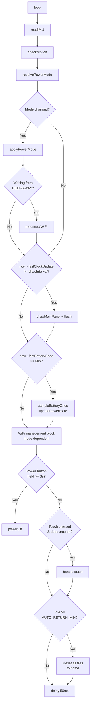
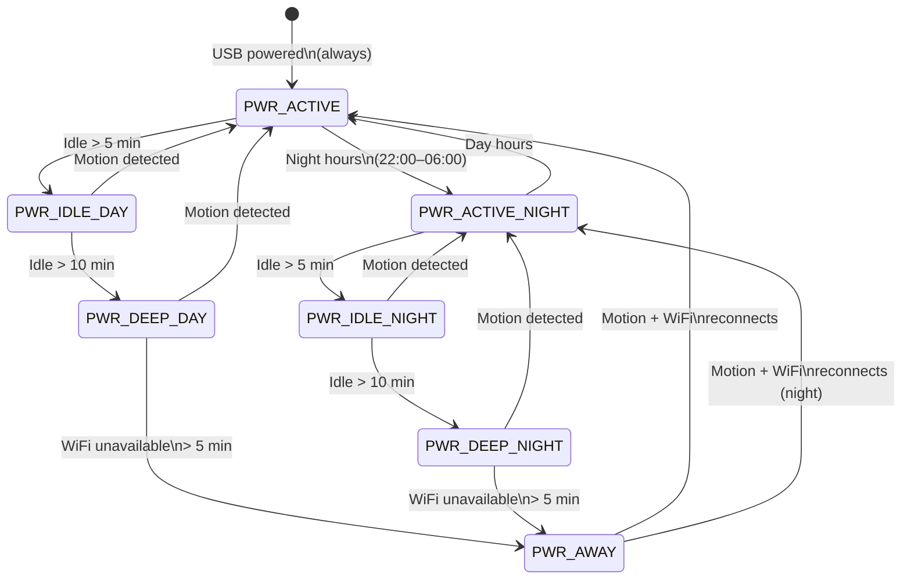
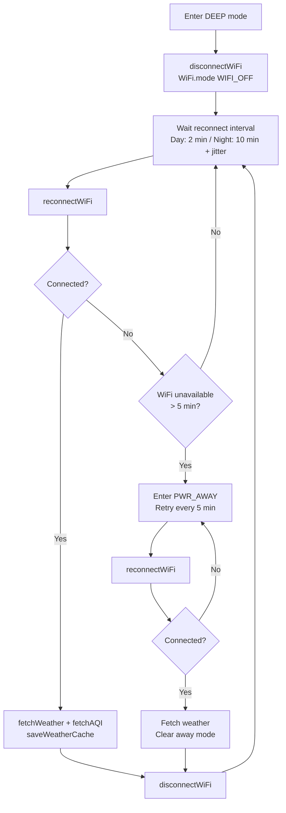
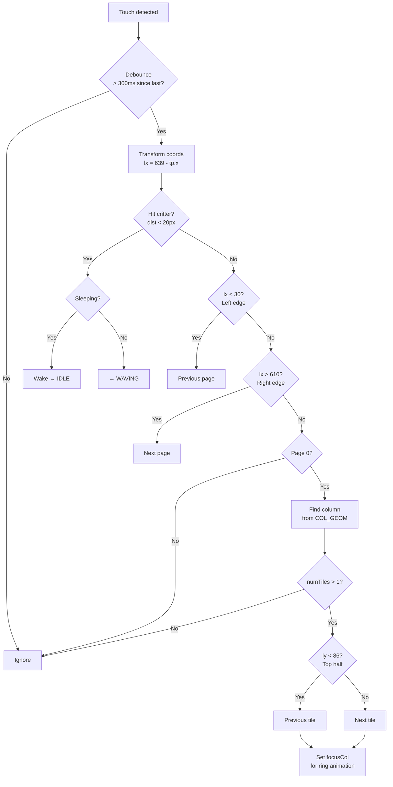
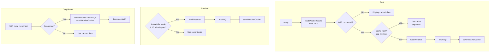
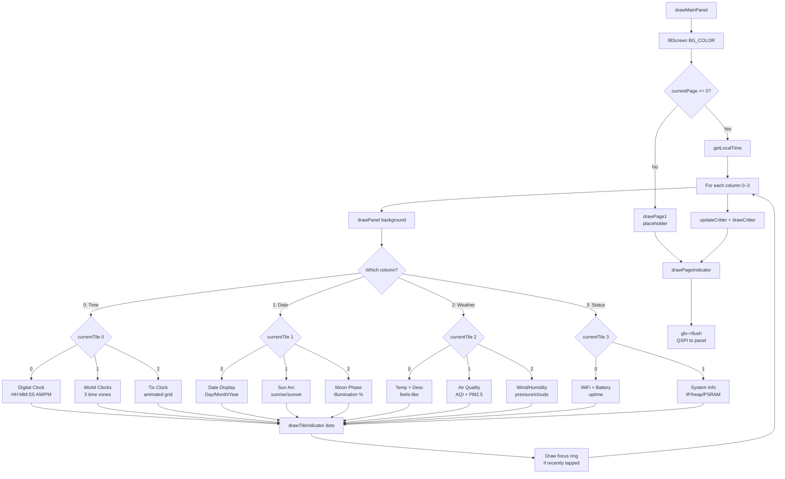
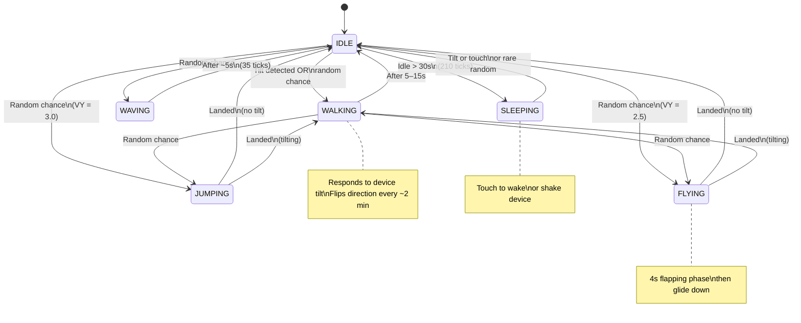

# Desk Status Bar — ESP32-S3-Touch-LCD-3.49

A WiFi-connected always-on desk HUD built for the Waveshare ESP32-S3-Touch-LCD-3.49's unique 640x172 bar display.

## What It Does

```
+--------------+-----------------+----------------+-------------+
|              |                 |                |             |
|   12:34      |   Monday        |   72°F         |  WiFi OK    |
|      :56 PM  |   Mar 2         |   Clear sky    |  -42 dBm    |
|              |   2026          |   Feels 69°    |             |
|              |   W10 Day 66    |                |  85% ⚡     |
|              |                 |                |  Up: 3h 24m |
|              |                 |                |             |
+--------------+-----------------+----------------+-------------+
  TIME (160px)   DATE (172px)     WEATHER (152px)  STATUS (122px)
```

Each column has multiple tiles you can cycle through by tapping:

| Column | Tiles |
|--------|-------|
| Time | Clock (HH:MM:SS AM/PM), World Clocks (3 configurable) |
| Date | Day/Month/Year/Week, Sun Arc (sunrise/sunset), Moon Phase |
| Weather | Temp + Description, Air Quality (AQI), Wind + Conditions |
| Status | WiFi/Battery/Uptime, System Info (IP, heap, PSRAM, CPU) |

A tiny animated critter pet roams the bottom of the screen, reacting to device tilt via the onboard accelerometer. Touch near it to make it wave.

## Features

- **NTP time sync** with PCF85063 RTC backup (instant time on boot, no WiFi wait)
- **Weather** via OpenWeatherMap (temp, feels-like, AQI, wind, humidity, pressure)
- **Sun arc** showing sunrise/sunset timeline with day/night progress dot
- **Moon phase** with illumination percentage
- **Touch navigation** — tap columns to cycle tiles, edge zones for page navigation
- **Audio feedback** — click sound on touch, startup chime (ES8311 codec + I2S)
- **USB power detection** — lightning bolt when charging, checkmark when full
- **Auto-dim** — dims backlight after inactivity (disabled on USB power)
- **Auto-return** — returns to home tiles after configurable inactivity
- **Power button** — 3-second hold to shut down (battery mode)
- **NVS weather cache** — shows last weather data immediately on boot

## Hardware

- **Board**: Waveshare ESP32-S3-Touch-LCD-3.49 (Case A or B)
- **Display**: 3.49" IPS, 172x640, AXS15231B QSPI
- **Touch**: AXS15231B integrated (I2C at 0x3B)
- **Audio**: ES8311 codec + I2S speaker
- **IMU**: QMI8658 accelerometer/gyroscope
- **RTC**: PCF85063 (battery-backed time)
- **I/O Expander**: TCA9554 (power latch, battery ADC, charger status, speaker amp)
- **Battery**: 18650 (Case A) or 3.7V LiPo (Case B)

## Quick Start

### 1. Install Board Support

Install [arduino-cli](https://arduino.github.io/arduino-cli/) or [Arduino IDE](https://www.arduino.cc/en/software), then add ESP32 board support:

```
https://espressif.github.io/arduino-esp32/package_esp32_index.json
```

### 2. Install Libraries

| Library | Author | Purpose |
|---------|--------|---------|
| GFX Library for Arduino | moononournation | Display driver (AXS15231B QSPI) |
| ArduinoJson | Benoit Blanchon | Weather API JSON parsing |
| SensorLib | Lewis He | QMI8658 IMU + PCF85063 RTC |

### 3. Configure

Copy `.env.local.example` to `.env.local` (if using Makefile) or edit `config.h` directly:

```cpp
#define WIFI_SSID     "YourNetwork"
#define WIFI_PASS     "YourPassword"

#define OWM_API_KEY   "abc123..."       // free at openweathermap.org/api
#define OWM_CITY      "New York"
#define OWM_UNITS     "imperial"        // or "metric"

#define UTC_OFFSET    -5                // your timezone
#define DST_OFFSET    1                 // 1 during daylight saving, 0 otherwise
```

See `config.h` for all options: brightness, critter enable, touch sound, auto-dim timeout, world clock labels/offsets, and more.

### 4. Build & Upload

**With Makefile (recommended):**

```bash
make build          # compile
make upload         # compile + upload
make monitor        # serial monitor (115200 baud)
make clean          # remove build artifacts
```

**With Arduino IDE:**

| Setting | Value |
|---------|-------|
| Board | ESP32S3 Dev Module |
| Flash Size | 16MB (128Mb) |
| PSRAM | OPI PSRAM |
| USB CDC On Boot | Enabled |
| Partition Scheme | Default 4MB with spiffs |

If upload fails: hold **BOOT**, press **RESET**, release **BOOT**, then retry.

## Project Structure

```
desk-status-bar/
  desk-status-bar.ino  — Setup, loop, globals, includes
  config.h             — User-editable settings (WiFi, API keys, display, timing)
  pins.h               — GPIO pin definitions and I2C addresses
  types.h              — Structs, enums, layout constants
  colors.h             — Color palette macros
  hal.h                — TCA9554, power latch, battery, backlight, auto-dim, USB detection
  imu.h                — IMU reading (QMI8658)
  networking.h         — WiFi, NTP, weather/AQI fetch, NVS cache
  audio.h              — ES8311 codec, I2S, click sound, startup tune
  drawing.h            — Panel drawing, weather icons, WiFi bars, sun arc, icon helpers
  critter.h            — Animated pet state machine + drawing
  tiles.h              — All 11 tile draw functions
  ui.h                 — Main panel dispatch, splash screen, indicators
  touch.h              — Touch polling + navigation
```

## Pin Mapping

> These pins match the Waveshare AXS15231B family. See `pins.h` for full details including I2C addresses and TCA9554 pin assignments.

| Function | Pin |
|----------|-----|
| QSPI CS | GPIO 9 |
| QSPI CLK | GPIO 10 |
| QSPI D0-D3 | GPIO 11-14 |
| LCD RST | GPIO 21 |
| Backlight | GPIO 8 (active-low PWM) |
| Touch SDA/SCL | GPIO 17/18 |
| Peripheral I2C SDA/SCL | GPIO 47/48 |
| I2S MCLK/BCLK/LRCK | GPIO 7/15/46 |
| Battery ADC | GPIO 4 (3:1 divider) |
| Power Button | GPIO 16 (also USB power detect) |

## Troubleshooting

**Display stays blank:**
- Verify PSRAM is enabled in board settings (OPI PSRAM)
- Check pin definitions in `pins.h` against the Waveshare schematic
- Try `ROTATION` values 0-3 in `config.h`

**Weather shows "loading...":**
- Check your OWM API key (test in browser first)
- Free tier keys can take a few hours to activate
- Check serial output for HTTP error codes

**Touch not responding:**
- Run the `i2c_scanner` sketch to verify the touch address
- Touch is polled via I2C, not interrupt-driven

**WiFi won't connect:**
- ESP32-S3 only supports 2.4GHz networks
- SSID/password are case-sensitive

**No sound:**
- Check `TOUCH_SOUND_ENABLED` is 1 in `config.h`
- The ES8311 codec needs I2S running before init (handled automatically)

## Architecture Diagrams

### Main Loop

Each `loop()` iteration runs these steps sequentially. The draw gate (`drawInterval`) controls frame rate, which varies by power mode.



### Power Management Tiers

The device transitions between 7 power modes based on USB power, motion idle time, WiFi availability, and time of day. USB power always forces full active mode.



### WiFi Cycling in Deep & Away Modes

Deep modes disconnect WiFi and periodically reconnect just long enough to fetch weather, then disconnect again. This is the primary battery conservation mechanism.



### Touch Navigation

Touch events are dispatched by screen position: critter hit area first, then edge zones for page navigation, then column zones for tile cycling.



### Weather Data Pipeline

Weather data flows from OpenWeatherMap through an NVS cache for instant display on boot. The cache is checked for freshness before making network calls.



### Tile Rendering Dispatch

`drawMainPanel()` iterates over 4 columns, drawing the currently selected tile in each. A focus ring animates briefly after touch.



### Critter State Machine

The animated pet has 6 states driven by tilt, touch, idle time, and randomness.



## License

Do whatever you want with this. It's your hardware, have fun.
